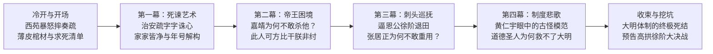

# 节目大纲：海瑞单挑嘉靖：抬棺死谏的大明第一狂人，到底是圣人还是偏执狂？（EP09）

> 时长目标：28-32 分钟 | 题型：争议站队 × 人物与制度深度解构型  
> 阵容：大开（学者型主讲） + 小李（主持/打工人视角/锐利追问）（固定双人，不设第三角色）

---

## 全期发现路径与时间轴

---

### [00:00-01:05] 冷开场（极度戏剧化的君臣生死对峙）
- **类型**：名场面还原式
- **台词要点**：
  - **大开**：嘉靖四十五年二月的一天，北京西苑万寿宫。六十岁病入膏肓的嘉靖皇帝，突然把手里的奏折狠狠砸在地上，指着门外暴怒嘶吼：快派锦衣卫去抓人，千万别让他跑了！
  - **小李**：伺候在一旁的司礼监太监黄锦却跪在地上叹了一口气，说了句让嘉靖目瞪口呆的话：万岁爷，不用抓，他绝不会跑。他写完这封折子，就已经给自己买好了一口薄皮棺材，遣散了妻儿，现在正穿戴整齐坐在官署里等死呢……

---

### [01:05-02:30] 报幕 + 选题缘由（承接嘉靖四十五年王朝暮气）
- **固定报幕**：“大家好，这里是《笑谈历史》，我是大开。大家好，我是小李。”
- **缘由与时代接续**：
  - 承接上一期 EP08《嘉靖大礼议》：我们在 EP08 讲了嘉靖十五岁时单挑整个内阁、午门廷杖打碎文官脊梁的天才逆袭。四十五年过去，当年的热血少年如今成了六十岁的深宫老道士。
  - 严嵩倒了，徐阶跪舔，几十年不上朝，整个大明帝国万马齐喑。就在所有人都把嘉靖当成喜怒无常的魔鬼、不敢说一句真话的时候，突然从琼州海岛跳出来一个正六品小官海瑞，抬着一口棺材，送上了一篇把皇帝内裤都扒光了的《治安疏》！

---

### [02:30-09:30] 第一幕：骂皇帝的艺术——《治安疏》到底写了什么大逆不道的话？
- **内容要点**：
  1. **海瑞出场背景**：正六品户部主事，既不是翰林也不是进士出身（举人出身），在大明文官序列里属于随时被忽略的底层；
  2. **《治安疏》（《直言天下第一事疏》）文本细读与高能骂点**：
     - **第一刀·破译年号谐音**：“嘉靖者，言家家皆净而无财用也！”——直接当着皇帝面撕开繁荣假象，说天下的老百姓家里全被搜刮得干干净净！
     - **第二刀·直击修仙迷信**：“不爱其民，日事斋醮，人以为怪”——痛斥皇帝天天躲在深宫吃重金属丹药、建修仙道场，全国人都觉得你是个怪物！
     - **第三刀·人伦全面否定**：“陛下为人君止于仁，为人父止于慈，陛下皆失之”——你当皇帝不仁，当爹不慈，连汉文帝的一根毫毛都比不上！
  3. **海瑞的“自杀式袭击”心理**：
     - 买棺材、留绝笔、打发老仆、诀别老母妻儿。
- **主播交锋**：
  - 小李吐槽：这根本不是提意见，这是直接骑在皇帝头上拿大耳刮子抽！换成任何一个朝代，九族都得被消消乐了！
  - 大开剖析：海瑞的高明之处在于，他全篇引用朱元璋的《皇明祖训》和孔孟正义，把道德高地占得死死的，让嘉靖在理论上连还手的招架之力都没有。
- **金句**：
  - “满朝文武都在用谎言维系着皇帝的体面，唯独海瑞一个人，拿着一把道德的手术刀，当着全天下人的面把皇帝给活活解剖了。”

---

### [09:30-16:30] 第二幕：嘉靖的囚徒困境——为什么暴君至死不敢杀他？
- **内容要点**：
  1. **嘉靖的抓狂与反复研读**：
     - 奏折被嘉靖摔了捡、捡了摔，放在案头反复读了几十遍；
     - 嘉靖对身边人叹息：“此人可方比干，第朕非纣耳！”——他想当流芳百世的比干，朕偏不当千古唾骂的商纣王！
  2. **天才帝王被彻底击穿的挫败感**：
     - 嘉靖自负聪明一世，靠权术玩弄了严嵩、徐阶一辈子，但他从海瑞身上感受到了前所未有的绝望：这是一个不怕死、不要钱、不要官的“纯粹之人”，一切权术在绝对的无私面前全部失灵！
  3. **徐阶与大理寺的暗中周旋**：
     - 首辅徐阶如何冒着杀头危险打掩护，把海瑞压在刑部大牢拖延时间；
     - 海瑞在大牢里关了将近一年，直到嘉靖咽下最后一口气，海瑞在狱中听闻皇帝驾崩，竟当场嚎啕大哭、悲痛到呕血数升！
- **主播交锋**：
  - 小李大为震撼：海瑞被嘉靖关在死牢里天天等死，听到嘉靖死了，为什么反而哭到吐血？
  - 大开揭示忠君原教旨主义者的内心世界：海瑞从来不是反贼，他是一个爱君爱到骨子里的极致原教旨儒生。他骂嘉靖，是真心盼着皇帝成尧舜；皇帝死了，他的劝诫成了绝唱，他的信仰世界崩塌了。
- **金句**：
  - “一切权术最大的克星，不是更大的权术，而是一个连命都不要的死脑筋。”

---

### [16:30-23:30] 第三幕：古怪的模范官僚——为什么徐阶张居正都不敢重用他？
- **内容要点**：
  1. **穆宗朝出狱平步青云**：隆庆三年出任应天巡抚（正二品封疆大吏），管辖江南八府最富庶的核心区；
  2. **海青天的极端行政风暴**：
     - **打土豪打到救命恩人头上**：逼首辅徐阶退田！徐家兼并了二十多万亩田产，海瑞毫不留情，勒令徐阶退还半数田产，甚至把徐阶两个作恶的儿子发配边疆。徐阶气得吐血：我当年冒死救了你的脑袋，你今天转头来抄我家？！
     - **“海瑞判案法”的荒唐一面**：民间争讼，贫民告富豪，不论是非曲直，一律判富豪赔钱！海瑞的原话：“与其屈贫民，宁屈富民；与其屈愚直，宁屈巧诈。”
  3. **江南经济的休克与官僚集体崩溃**：
     - 富豪商贾吓得连夜出逃，店铺关门，整个江南的商业流通几乎被他搞瘫痪；
     - 巡抚任职仅八个月就被群臣弹劾罢免。
  4. **张居正的十六年冷冻**：
     - 张居正执政十年，重用戚继光、潘季驯，唯独把海瑞死死按在家里赋闲十六年。
     - 张居正的名言拆解：“如吉礼之有明水，朝会之有重器”——海瑞是供在太庙里的青铜大鼎，用来展览道德很庄严，但绝不能拿来盛汤盛饭办实事。
- **主播交锋**：
  - 小李吐槽：如果我是海瑞的同事或者下属，我真的会被他逼得当场辞职，他不仅自己当苦行僧，还要逼所有人都不准吃饭！
  - 大开剖析行政管理的残酷规律：治理一个庞大帝国靠的是制度与利益妥协，靠道德高压不仅治不好腐败，反而会让整个官僚机器彻底躺平。
- **金句**：
  - “当一个官僚系统只剩下海瑞这一个清官的时候，该反思的不是贪官，而是逼着所有人去当圣人的制度本身。”

---

### [23:30-30:30] 第四幕：道德圣人的制度悲歌——当清官成为国家唯一的救命稻草
- **内容要点**：
  1. **万历朝的凄凉落幕**：
     - 万历十三年七十二岁被起用为南京右都御史；万历十五年病逝于任上。
     - 佥都御史王用汲去海家吊唁，家徒四壁，竹箱里只有几件褪色的旧葛布袍子和八两碎银，连下葬的寿木都是同僚凑钱买的；
     - 出殡那天，南京市民白衣白帽、跪满江岸，哭声震天，江面上百里缟素。
  2. **黄仁宇《万历十五年》的核心洞察**：
     - 为什么黄仁宇把海瑞定义为“古怪的模范官僚”？
     - 朱元璋建国时犯下的致命错误：制定极低的正俸（正七品县令一个月几两银子，连养活师爷都不够），同时要求官员保持极高的圣人道德操守；
     - 结果导致整个大明官僚系统分裂成两张皮：台面上满口仁义道德，台面下全靠灰色规费维系运转。
  3. **海瑞的悲剧内核**：
     - 海瑞的“古怪”在于：他是两百年来唯一一个**真的把朱元璋的制度当真、真的按照圣人标准去执行**的人！
     - 他就像一个拿着两百年前的破旧图纸，硬要去修补一艘漏水巨轮的孤独修理工，他越认真，轮船沉得越快。
- **金句**：
  - “海瑞的伟大在于他人性的纯粹，但海瑞的悲哀在于——一个帝国必须靠殉道者去碰得头破血流才能证明自己的存在，这个帝国就已经无可挽救了。”

---

### [30:30-33:00] 收束：告别道德神话，读懂真正的历史沉重
- **核心回扣**：
  - 我们今天聊海瑞，不是要解构他的清白与崇高；海瑞那份视死如归的骨气，永远是中华文明脊梁骨的一部分；
  - 但我们必须超越民间的“青天崇拜”。真正的现代文明，不是期待天上掉下来一个海瑞，而是把权力关进制度的笼子里，让普通人不用当圣人，也能做好官。

---

### [33:00-35:00] 结尾菜单与下期挖坑
1. **互动话题**：
   - “在现实的工作或团队中，如果遇到一个专业极强、道德纯白无暇，但行事绝对刚硬、寸步不让的‘海瑞式同事’，你更愿意与他合作，还是对他敬而远之？评论区聊聊。”
2. **下期精准预告（系列闭环）**：
   - “海瑞逼徐阶退田之后，嘉靖驾崩，大明王朝迎来了一场更加凶险的权力绞杀——**同为心学传人的徐阶与高拱，为什么在内阁里撕得比死敌严嵩还要难看？** 敬请期待下期节目！”
3. **求三连与告别语**：
   - 感谢收听，双人齐声：“谢谢朋友们，下期见！”
