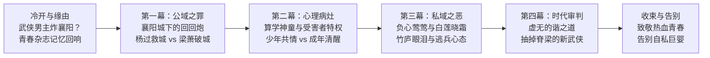

# 节目大纲：武侠男主炮轰襄阳城？重读凤歌《昆仑》，为什么我们不再原谅梁萧（EP09）

> 时长目标：30-35 分钟 | 题型：网感概念 × 争议站队型 | 结构模板：IP深读与时代价值审判模板  
> 阵容：大开（学者型主讲） + 小李（主持/锐利吐槽/真实读者视角）（固定双人，不设第三角色）

---

## 全期发现路径与时间轴

---

### [00:00-00:50] 冷开场（悬念碎片与认知颠覆）
- **类型**：悬念碎片式
- **台词要点**：
  - **小李**：“等等，大开！你今天跟我说的这个剧情真的没搞错吗？！一个武侠小说堂堂正正的男一号，最后带兵去围攻襄阳，还亲手造巨炮把襄阳城墙给轰塌了？！郭靖黄蓉守了一辈子的襄阳，被自家人炸了？！这到底是哪个‘大侠’干的阳间事啊？！”
  - **大开**：“这就是二十年前统治整个《今古传奇·武侠版》的无上神作、凤歌《昆仑》的男主角——梁萧。当年万人崇拜的叛逆神童，今天却成了全网唾弃的‘科技带路党’。”

---

### [00:50-02:30] 报幕 + 选题缘由（唤醒一代人的武侠乡愁）
- **固定报幕**：“大家好，这里是《笑谈历史》，我是大开。大家好，我是小李。”
- **缘由与感怀**：
  - 宣布开启全新特别季——**“那些年我们读过的武侠”系列**！
  - **唤醒青春记忆**：回忆二十年前（2003-2005年）在中学课桌底下，半月一期的《今古传奇·武侠版》全班男生偷偷传阅、翻到封面脱落的痴迷时光；
  - 第一次读到“天机十算”，看到数学几何和物理抛物线居然能融入武学杀敌破阵，那种整个人头皮发麻的惊艳；
  - **抛出本期核心反差**：为什么当年我们废寝忘食崇拜的孤傲少年，二十年后重读，却满心都是痛惜与批判，甚至再也无法原谅他的所作所为？

---

### [02:30-09:30] 第一幕：神作的起点与致命轰鸣——襄阳城下的“回回炮”
- **内容要点**：
  1. **还原破城名场面**：宋蒙襄阳大战，蒙古大军久攻不下；男主梁萧利用九宫算术与配重力学，计算弹道改良制造出“回回炮”；巨石如雨，襄阳城破，守军死伤枕藉，南宋国运自此崩塌；
  2. **正史考据 vs 文学嫁接**：
     - 正史中造回回炮的是阿拉伯工程师阿老瓦丁与亦思马因（至元八年奉召至大都，十年破樊城与襄阳）；
     - 凤歌为了让主角展现“科学与理性的至高力量”，强行把灭宋神器戴在梁萧头上；
  3. **杨过 vs 梁萧的命运对照**：
     - 同样是父母深仇、反抗世俗名教的叛逆少年；
     - 金庸让杨过在襄阳前线守住良知，飞石击毙蒙哥，飞升为“神雕大侠”；
     - 凤歌却让梁萧把才华变成了屠杀同胞的利刃，实打实屠了城。
- **感怀与批判的平衡**：
  - 大开指出凤歌当年的宏大野心：他想跳出金庸“忠君爱国”的传统窠臼，写一个超脱狭隘民族阵营、追求纯粹真理的现代科学探索者；
  - 小李犀利回击：理想很丰满，但现实是血淋淋的白骨！当科技失去了对生命的敬畏，当所谓超越阵营变成了替侵略者递刀，这就是最无可辩驳的“科技带路党”。
- **梗锚点**：
  - “郭靖九泉之下看见梁萧，降龙十八掌都得气出加特林射速。”
  - “别人家男主是为国为民，梁萧是直接给元军送导弹精准制导系统。”
- **金句**：
  - “金庸用襄阳保卫战给武侠立了一座精神丰碑，凤歌却让男主角亲手把这座丰碑炸成了废墟。”

---

### [09:30-16:30] 第二幕：天才的特权与巨婴的戾气——梁萧是怎么长歪的？
- **内容要点**：
  1. 回溯梁萧成长轨迹：前传《铁血天骄》憨厚忠良的父亲梁文靖惨死，梁萧沦为孤儿，流落江湖受尽欺凌；
  2. **梁萧的性格暗面**：幼年被欺负，他就虐杀公羊羽的白鹤做陷阱报复；心胸逼仄，报复心极强；
  3. 拜入天机宫，习得天机十算，数学物理降维打击整个江湖。
- **认知反差（少年共情 vs 成年清醒）**：
  - **为什么当年我们那么爱他？** 因为少年时期的我们正处于青春期叛逆，敏感脆弱，觉得自己被世界误解，渴望用绝对的才华让所有人闭嘴。梁萧精准迎合了少年的中二爽感；
  - **为什么成年后觉得恶心？** 成年人走进社会，才看清梁萧身上的【受害者特权心态】——“因为全世界都欺负过我，所以全世界都欠我的；谁让我不爽，我就毁掉谁”。
- **跑偏与对比（金庸式的天才 vs 凤歌式的做题家）**：
  - 对比黄药师与杨过：黄药师再邪狂，也有桃花岛的骨气与救国情怀；杨过再偏激，也懂得投桃报李、悲悯老弱；
  - 梁萧的狂傲，带着一种当代“精致利己做题家”的冰冷：我有天赋我最大，你们这帮愚蠢的凡人死了活该。
- **金句**：
  - “才华可以解释一个人的孤傲，但永远不能给他的残忍充当免罪符。”

---

### [16:30-23:30] 第三幕：红白玫瑰的血泪账——负心柳莺莺与病弱花晓霜
- **内容要点**：
  1. **情感双线复盘**：
     - **柳莺莺**：烈火长空、敢爱敢恨、数次为梁萧九死一生，是新武侠最动人的奇女子；
     - **花晓霜**：体弱多病、动辄咯血昏厥、善良却无力的白玫瑰；
  2. **命运的死结与意难平**：阿雪误救重伤的梁萧导致失联，柳莺莺在狂风暴雨的竹庐苦等，最终心碎斩断情丝远走天山大漠；
  3. **梁萧的逃兵心理**：梁萧明知亏欠柳莺莺，却在花晓霜父母的道德捆绑与救赎叙事中，顺理成章地娶了花晓霜。
- **真挚的情感流露与审判**：
  - 小李回忆当年读到柳莺莺在大漠吹响牧笛时的揪心与眼泪——“当年多少读者为了柳莺莺哭湿了枕头，那是我们一代人的青春白月光啊！”
  - 现代视角的本质拆解：梁萧在感情上就是个懦夫！柳莺莺太耀眼、太独立，需要男主平等而担当的爱；而花晓霜永远病弱、永远仰视他，让梁萧能够躲进温柔乡里扮演救世主。
- **梗锚点**：
  - “柳莺莺陪他流血创业打天下，花晓霜最后直接继承家族信托。”
  - “梁萧在战场上算得出微积分，在感情里连个担当都算不出来。”
- **金句**：
  - “在真正的爱面前，梁萧是个逃兵；他最终选择花晓霜，不过是选择了一面不会照出自己懦弱的镜子。”

---

### [23:30-30:30] 第四幕：大洋彼岸的“谐之道”——当解构消亡，武侠还剩下什么？
- **内容要点**：
  1. 梁萧的终局：襄阳城破、母亲惨死、生灵涂炭，梁萧在幻灭中流亡海外孤岛，建立“天道盟”，参悟“谐之道”；
  2. **时代范式转移深度剖析**：
     - 二十年前（2004年），读者生活在平稳向上的象牙塔里，有闲心去欣赏“个人叛逆、怀疑崇高、虚无反思”；
     - 二十年后，现实风浪让所有人明白：秩序、民族守护、责任担当是多么重若千钧。
  3. **凤歌的得与失**：
     - 肯定凤歌的探索：他敢于把数学物理引入武侠，敢于挑战金庸的大一统江湖，这份文学探索的诚意与绚烂才华永远值得敬佩；
     - 指出新武侠的致命内伤：凤歌以为用算学给武侠穿上了现代西装，却不小心抽掉了武侠最核心的脊梁骨——“侠之大者，为国为民”。没有了悲悯与责任，神乎其神的算学，只是一场冷冰冰的炫技。
- **金句**：
  - “一个人炸碎了人间烟火之后，跑到海岛上去讲天地和谐，那不叫顿悟，那叫文青的破产清算。”

---

### [30:30-33:30] 收束：致敬热血青春，告别自私巨婴
- **核心回扣与情感升华**：
  - 我们今天批判梁萧，绝不是为了否定当年那个在被窝里打着手电筒看《昆仑》的少年；
  - 恰恰相反，是因为当年那个少年终于长大了。我们告别梁萧，是因为我们终于明白了：**这世界上最强大的力量不是微积分和绝世武功，而是明知世道艰难，依然愿意去守护身后的普通人。**

---

### [33:30-35:30] 结尾菜单与下期挖坑
1. **互动讨论题**：
   - “当年读《昆仑》，你是在哪一个瞬间对梁萧感到痛惜或者失望的？是在襄阳城下，还是在竹庐风雨中？评论区留下你的武侠记忆。”
2. **下期精准预告**：
   - “今天我们把梁萧拉上了审判席，但《昆仑》里最让我们心疼的，永远是那个在大漠吹响牧笛的红衣女子。下期节目，我们专门聊聊《昆仑》里的女人们——**为什么说柳莺莺是大陆新武侠最壮烈的一朵红玫瑰，而花晓霜却成了读者挥之不去的阴影？** 我们下期接着聊！”
3. **求三连与告别语**：
   - 感谢收听，双人齐声：“谢谢朋友们，下期见！”
